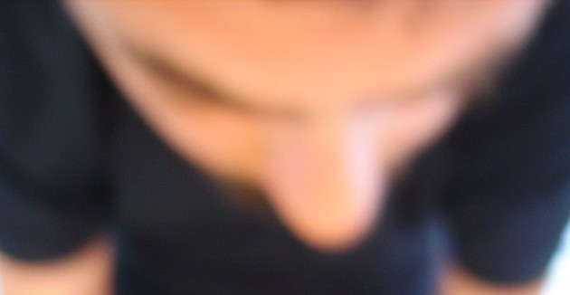

# say-hello-bermarte

## Bernardo Martelli (Bermarte)

I am a video editor recently converted to development. At the moment I am enrolled as a student in a web development training program held by [HYF](https://hackyourfuture.be/). 

## About me
### info
- :house: Markgravelei 104 2018 Antwerpen Belgium
- :phone: +32 478 200537
- :postal_horn: bernardo.martelli@gmail.com
### social
- https://be.linkedin.com/in/bernardo-martelli
- https://github.com/bermarte
- https://www.deviantart.com/bermarte
- https://codepen.io/Bermarte
- https://www.flickr.com/photos/bermarte/

### education
- University of Bologna (Master in Philosophy)
- Becode (web programming)

### skills
- Web development
- 3D animation

### interests
- Making illustrations
- Making music

### Languages
- Italian
- English
- Dutch
- French

---

